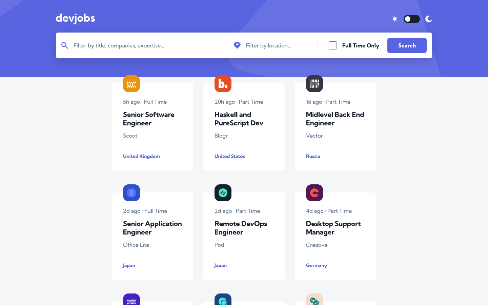
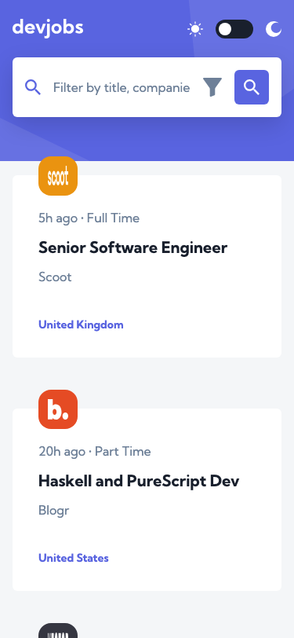

# Frontend Mentor - Devjobs web app solution

This is a solution to the [Devjobs web app challenge on Frontend Mentor](https://www.frontendmentor.io/challenges/devjobs-web-app-HuvC_LP4l). Frontend Mentor challenges help you improve your coding skills by building realistic projects.

## Table of contents

- [Overview](#overview)
  - [The challenge](#the-challenge)
  - [Screenshots](#screenshots)
  - [Links](#links)
- [My process](#my-process)
  - [Built with](#built-with)
  - [What I learned](#what-i-learned)
  - [Continued development](#continued-development)
  - [Useful resources](#useful-resources)
  - [AI Collaboration](#ai-collaboration)
- [Running the project](#running-the-project)
- [Author](#author)
- [Acknowledgments](#acknowledgments)

## Overview

### The challenge

Users can:

- View the optimal layout for the job board and job detail pages depending on their device's screen size (mobile, tablet, desktop)
- See hover states for all interactive elements throughout the site
- Filter jobs on the index page by title/company, location, and whether a job is full-time, with all three filters combining
- Click a job from the index page to read the full description, requirements, and role, and apply for it
- **Bonus**: Get the correct color scheme automatically based on their OS preference (`prefers-color-scheme`), with a manual light/dark toggle that overrides it and persists across visits

### Screenshots

<p>
  
</p>
<p>
  
</p>

### Links

- Solution URL: _Add your Frontend Mentor solution URL here once submitted_
- Live Site URL: _Add your Vercel deployment URL here once deployed_

## My process

### Built with

- Semantic HTML5 markup
- CSS Modules with design tokens (colors, spacing, radius, typography) pulled from the Figma Design System, driving both the light and dark themes via CSS custom properties
- Flexbox and CSS Grid, mobile-first
- [React 19](https://react.dev/) with TypeScript
- [Vite](https://vitejs.dev/) as the dev server and build tool
- [React Router](https://reactrouter.com/) for client-side routing (`/` and `/jobs/:id`)
- [Vitest](https://vitest.dev/) + [React Testing Library](https://testing-library.com/react) for unit/component tests
- [oxlint](https://oxc.rs/docs/guide/usage/linter.html) for linting

### What I learned

The trickiest part of this challenge wasn't the desktop layout — it was making the same components collapse correctly at mobile widths. The company info card and the "Apply Now" header both switch from an inline row (desktop/tablet) to a stacked layout (mobile) by wrapping the flex container and giving the trailing element `flex-basis: 100%` below the tablet breakpoint:

```css
.jobHeading {
  display: flex;
  flex-wrap: wrap;
  justify-content: space-between;
  gap: var(--spacing-300);
}

.jobHeading .applyButton {
  flex-basis: 100%; /* full-width row on mobile */
}

@media (min-width: 768px) {
  .jobHeading {
    flex-wrap: nowrap;
  }

  .jobHeading .applyButton {
    flex-basis: auto; /* back to an inline row on tablet/desktop */
  }
}
```

I also learned to distrust screenshot tooling more than I'd like to admit: a CLI `--screenshot` capture at 375px consistently showed the search bar overflowing off-screen, which looked like a real responsive bug. Cross-checking with `getBoundingClientRect()` in a live tab, and later with the Chrome DevTools Protocol's `Emulation.setDeviceMetricsOverride`, showed the layout was actually correct — the CLI flag was capturing before the window's resize had fully reflowed the page. The fix wasn't in the CSS; it was scripting the screenshot through CDP so the viewport is set *before* navigation instead of resized after.

### Continued development

- Add automated visual regression coverage (e.g. Playwright screenshot testing) at the three target breakpoints, now that I have a reliable CDP-based capture approach
- Explore `prefers-reduced-motion` for the theme-toggle and hover transitions
- Look at extracting the repeated "stack on mobile, row on tablet+" pattern (used in both the company card and job heading) into a shared CSS utility instead of duplicating it per component

### Useful resources

- [MDN: Flexbox and min-width](https://developer.mozilla.org/en-US/docs/Web/CSS/CSS_flexible_box_layout/Mastering_wrap_reverse) - clarified why nested flex containers need explicit `min-width: 0` to shrink properly
- [Chrome DevTools Protocol Viewer](https://chromedevtools.github.io/devtools-protocol/) - reference for `Page` and `Emulation` domains, used to script reliable, race-free screenshots

### AI Collaboration

I used Claude Code throughout this project, working from a plan we agreed on up front rather than freeform prompting.

- **Planning**: Before writing any code, I had Claude read the challenge brief, the Figma file (via the Figma Desktop MCP integration), and `data.json`, then propose an implementation plan (tech choices, folder structure, git branching strategy) that I reviewed and adjusted before implementation started.
- **Implementation**: Claude scaffolded the Vite/React/TypeScript project, built the components/hooks/pages, and wrote the Vitest test suite, pulling exact colors, spacing, and typography from the Figma Design System via MCP rather than guessing at values.
- **Debugging**: I caught two real mobile-layout bugs (the company card and Apply Now button overlapping other content below the tablet breakpoint) by comparing the running app screenshot against the Figma mobile frame; Claude traced them to a shared root cause (a flex row that needed to wrap and stack on mobile) and fixed both consistently.
- **What worked well**: Being specific about *which* Figma frame to compare against made bug reports fast to act on. Asking Claude to verify visually (not just re-read the CSS) caught issues a code-only review would have missed.
- **What didn't**: Automated screenshot capture for this README took much longer than expected — a CLI screenshot flag turned out to have its own race-condition bug, which needed independent verification (DOM measurements, then a CDP script) before trusting it over the "obviously broken" image it produced.

## Running the project

```bash
npm install
npm run dev       # start the Vite dev server
npm run test      # run the Vitest suite
npm run build     # type-check and build for production
npm run lint      # run oxlint
```

## Author

<p>
  <a href="https://www.linkedin.com/in/gustavosanchezgalarza/"></a>
  <a href="https://github.com/gusanchefullstack"></a>
  <a href="https://hashnode.com/@gusanchedev"></a>
  <a href="https://x.com/gusanchedev"></a>
  <a href="https://bsky.app/profile/gusanchedev.bsky.social"></a>
  <a href="https://www.freecodecamp.org/gusanchedev"></a>
  <a href="https://www.frontendmentor.io/profile/gusanchefullstack"></a>
</p>

## Acknowledgments

- [Frontend Mentor](https://www.frontendmentor.io) for the challenge brief, design files, and starter data
- The Figma Desktop MCP integration, which made it possible to pull exact design tokens (colors, spacing, type scale) straight from the Design System page instead of eyeballing them from screenshots
